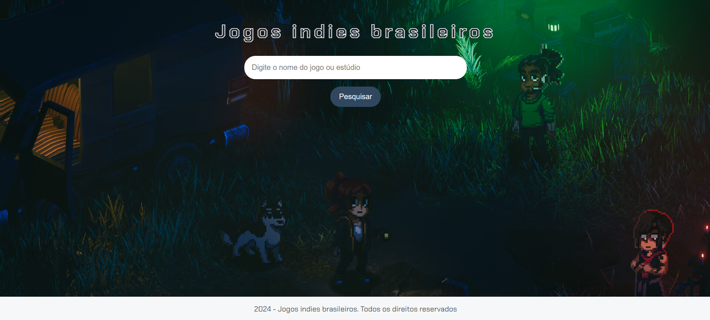

Jogos indies brasileiros é um projeto desenvolvido na Imersão dev com Google Gemini feito apenas com HTML, CSS e JavaScript.

**Como funciona?**

1. **Digite e descubra:** Basta digitar o nome de um jogo ou estúdio na barra de pesquisa e pronto! A aplicação vasculha nossa base de dados e te mostra todos os jogos relacionados à sua busca.
2. **Resultados personalizados:** A cada pesquisa, a aplicação te mostra uma lista com todos os jogos encontrados, com informações como nome, estúdio, descrição e link para a página na Steam.
3. **Um toque de aleatoriedade:** Para deixar tudo mais divertido, a cada pesquisa, a aplicação escolhe aleatoriamente uma imagem de um dos jogos encontrados e coloca ela como plano de fundo da página. Assim, você pode se inspirar visualmente enquanto navega pelos resultados.

**Tecnologias usadas:**

* **HTML**
* **CSS**
* **JavaScript**
